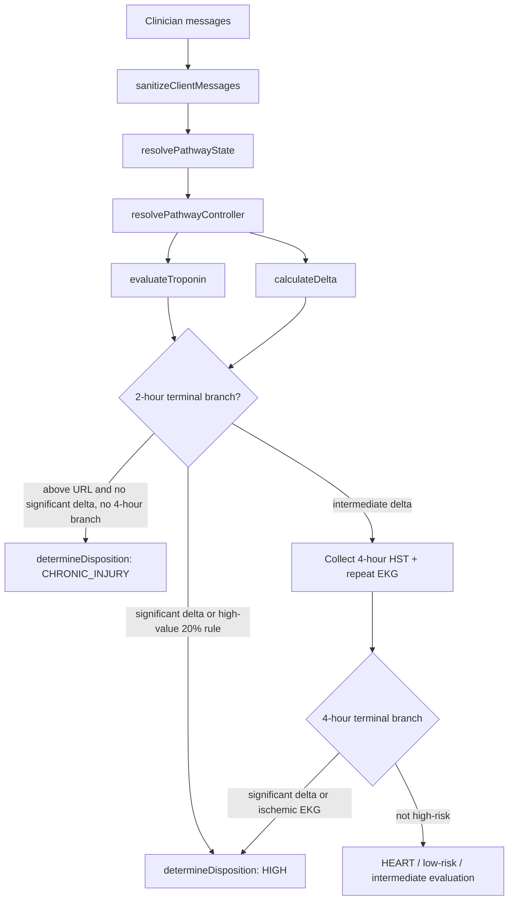

# fix: Resolve HST prototype failed cases

## Summary

This plan closes the six failed or partially passing scenarios from the June 2026 Rush HST-I prototype testing summary by adding exact deterministic regressions, tightening controller branch ordering, and broadening symptom-duration parsing. The fix preserves the current boundary that clinical thresholds, deltas, and dispositions are server-owned rather than model-computed.

---

## Problem Frame

Prototype testing covered 12 physician-authored cases from the Rush hs-TnI pathway. Four failed and two partially passed. The failures cluster around serial troponin branching after the 2-hour draw, chronic injury eligibility after 4-hour follow-up, sex-specific URL routing, a redundant ongoing-chest-pain prompt after terminal high-risk deltas, and free-text duration parsing.

The repo already has deterministic primitives and a 30-case pathway audit. The plan treats the tester report as a regression signal: existing primitives may be correct in isolation, but the end-to-end controller, sanitizer, and exact tester phrasing need coverage.

---

## Requirements

### Delta and Rule-In Behavior

- R1. A 2-hour absolute delta of at least 15 ng/L must terminate as High Risk / Admit even when both troponin values are below the sex-specific 99% URL.
- R2. When either compared HST value is at least 100 ng/L, a relative delta of at least 20% must terminate as High Risk / Admit at the 2-hour branch without ordering a 4-hour HST.
- R3. A falling delta of at least 15 ng/L must terminate as High Risk / Admit without asking ongoing chest pain when that answer cannot change the disposition.

### Chronic Injury and 4-Hour Branching

- R4. Chronic Injury must be available for the MI-ruled-out serial branch where any troponin is at or above the sex-specific 99% URL and there is no significant delta.
- R5. Chronic Injury must not be offered after the pathway has entered the 4-hour follow-up branch for an intermediate 2-hour delta.
- R6. Female 99% URL evaluation must use 14 ng/L, so a female 0-hour HST of 16 ng/L with no significant serial delta routes to Chronic Injury evaluation rather than a 4-hour HST.

### Input Handling and Regression Safety

- R7. Free-text symptom duration such as `3 hours 15 minutes` must normalize to a numeric hour value and advance the pathway.
- R8. The exact tester-reported failed and partial cases must be represented in deterministic tests at both tool/controller level where applicable.
- R9. Existing passed pathways from the tester report, including STEMI, early rule-out, ESRD override, early presenter repeat-HST, and significant 4-hour delta, must remain protected by the existing audit suite.

---

## High-Level Technical Design

The key design change is branch provenance. The controller already carries `delta_range` and `has_4hr_result`; the plan makes those values determine which disposition families are eligible before asking questions that cannot change terminal outcomes.

---

## Key Technical Decisions

- KTD1. Add tester-case regressions before changing branch logic: the repo already has broad pathway tests, but the reported failures show gaps between generic pathway coverage and the exact clinical walkthroughs used in prototype testing.
- KTD2. Keep threshold math in `src/lib/tools.ts`: `calculateDelta` and `evaluateTroponin` remain the only owners of delta significance and sex-specific URL checks, so the controller consumes tool outputs rather than duplicating clinical math.
- KTD3. Move terminal high-risk checks ahead of ongoing-pain elicitation: significant rising/falling deltas and ischemic EKG findings already settle High Risk, so asking ongoing pain first creates redundant prompts and delays final disposition.
- KTD4. Treat Chronic Injury as branch-eligible, not merely value-eligible: any above-URL troponin is not enough after the controller has already entered 4-hour follow-up for an intermediate 2-hour delta.
- KTD5. Parse compound symptom duration at the sanitizer and state layers: typed answers need context normalization in `src/lib/chat-request.ts`, while bundled test cases and direct controller calls need extraction support in `src/lib/pathway-state.ts`.

---

## Acceptance Examples

- AE1. Given male, no ESRD, symptoms for 5 hours, 0-hour HST 3 ng/L, 2-hour HST 18 ng/L, and non-ischemic repeat EKG, when the controller resolves the pathway, then the terminal result is High Risk with a significant delta and no 4-hour HST request.
- AE2. Given 0-hour HST 100 ng/L and 2-hour HST 120 ng/L, when delta is calculated and the controller resolves the pathway, then the relative 20% rule is the significant-delta method and the terminal result is High Risk.
- AE3. Given a falling delta of at least 15 ng/L that represents recent MI, when the controller reaches the 2-hour branch, then it terminates as High Risk without asking ongoing chest pain.
- AE4. Given an intermediate 2-hour delta that requires a 4-hour draw, when the 4-hour draw is not high-risk, then Chronic Injury is not returned solely because a troponin value is above URL.
- AE5. Given a female patient with 0-hour HST 16 ng/L and no significant serial delta, when the controller resolves the serial branch, then it returns Chronic Injury rather than requesting a 4-hour HST.
- AE6. Given the active symptom-duration prompt and user text `3 hours 15 minutes`, when messages are sanitized and state is resolved, then `symptomDurationHours` is 3.25 and the next required field advances.

---

## Implementation Units

### U1. Capture Prototype Failures as Regressions

**Goal:** Add exact failing and partial prototype cases so implementation cannot satisfy broad pathway tests while missing the physician-tested scenarios.

**Requirements:** R1, R2, R3, R4, R5, R6, R7, R8, R9.

**Dependencies:** None.

**Files:**
- `src/__tests__/hst-prototype-regression.test.ts`
- `src/__tests__/pathway-decision-tree-30.test.ts`
- `src/lib/pathway-controller.test.ts`
- `src/lib/pathway-state.test.ts`
- `src/lib/chat-request.test.ts`

**Approach:** Create a focused regression test file named for the prototype testing summary, then add smaller unit-level assertions to existing suites when a failure belongs to a specific layer. Keep the existing 30-case audit intact; extend it only where the tester case is a canonical pathway branch rather than a one-off phrasing regression.

**Execution note:** Start with failing tests that reproduce the six reported bugs before changing implementation.

**Patterns to follow:** Reuse `userMessage`, `resolve`, `controller`, `trop`, `delta`, and `disposition` helpers from the existing test suites.

**Test scenarios:**
- Covers AE1. Controller resolves below-URL 0-hour and 2-hour values with absolute delta 15 ng/L as terminal High Risk and never requests `hst4`.
- Covers AE2. Controller resolves 0-hour 100 ng/L and 2-hour 120 ng/L as terminal High Risk with `delta_category: "significant"`.
- Covers AE3. Controller resolves a falling delta of at least 15 ng/L as terminal High Risk without `requiredField: "ongoingChestPain"`.
- Covers AE4. Controller enters the 4-hour branch after an intermediate 2-hour delta and does not return `risk: "CHRONIC_INJURY"` for the non-high-risk 4-hour outcome.
- Covers AE5. Female patient with 0-hour HST 16 ng/L and minimal serial delta routes to `risk: "CHRONIC_INJURY"` without `requiredField: "hst4"`.
- Covers AE6. Sanitized active-question flow converts `3 hours 15 minutes` into symptom-duration context, and direct state extraction returns `symptomDurationHours: 3.25`.
- Existing passed cases from the tester report still pass through the original decision-tree audit.

**Verification:** The new regression tests fail before behavior changes and pass after the planned controller, tool, and parser changes. Existing audit cases still cover the previously passing branches.

### U2. Gate Terminal High-Risk Outcomes Before Redundant Follow-Up Questions

**Goal:** Ensure significant 2-hour deltas and other already-terminal high-risk branches stop before asking ongoing chest pain or ordering a 4-hour draw.

**Requirements:** R1, R2, R3, R8, R9.

**Dependencies:** U1.

**Files:**
- `src/lib/pathway-controller.ts`
- `src/lib/pathway-controller.test.ts`
- `src/__tests__/hst-prototype-regression.test.ts`
- `src/__tests__/pathway-decision-tree-30.test.ts`

**Approach:** In `resolvePathwayController`, evaluate terminal high-risk conditions immediately after the 2-hour troponin, delta, and repeat EKG state are known. Only ask `ongoingChestPain` when the answer can change a non-terminal branch. Preserve the server snapshot contract: terminal snapshots have no required field and no quick-reply buttons.

**Patterns to follow:** Follow the existing `runDisposition` wrapper and terminal STEMI / early-rule-out snapshot structure in `src/lib/pathway-controller.ts`.

**Test scenarios:**
- Rising below-URL 2-hour delta of 15 ng/L returns terminal High Risk with a significant delta result present.
- Falling delta of at least 15 ng/L returns terminal High Risk and includes Footnote G provenance.
- Significant 2-hour delta with no ongoing-pain answer returns terminal High Risk, not a prompt for ongoing pain.
- Significant 2-hour delta does not request `hst4`, even when both values are below the sex-specific URL.
- Ischemic repeat EKG remains terminal High Risk under the same early terminal gate.
- Minimal below-URL delta still asks ongoing chest pain before HEART scoring because that answer remains disposition-relevant.

**Verification:** Terminal high-risk controller snapshots stop with `requiredField: null`, `terminal: true`, and a final `determine_disposition` result. Non-terminal minimal-delta flows still ask the next clinically relevant field.

### U3. Make Chronic Injury Eligibility Branch-Aware

**Goal:** Restrict Chronic Injury to the MI-ruled-out serial branch and prevent it from appearing after the intermediate-delta 4-hour follow-up branch.

**Requirements:** R4, R5, R6, R8, R9.

**Dependencies:** U1, U2.

**Files:**
- `src/lib/tools.ts`
- `src/lib/pathway-controller.ts`
- `src/__tests__/pathway-decision-tree-30.test.ts`
- `src/__tests__/hst-prototype-regression.test.ts`

**Approach:** Extend the disposition contract with branch provenance or derive a stricter chronic-injury eligibility value before calling `determineDisposition`. The chosen shape should make Chronic Injury available when above-URL, non-significant serial troponins remain on the 0/2-hour MI-ruled-out branch, but unavailable once `has_4hr_result` reflects an intermediate-delta follow-up path.

**Technical design:** Directional guidance: model the disposition inputs as `delta_range` plus a branch/provenance fact, not as raw troponin values alone. The implementer can choose whether this is an explicit input or a controller-computed boolean, but the tool result must make the branch distinction testable.

**Patterns to follow:** Preserve `determineDisposition` as the single risk/disposition owner and keep controller code limited to choosing inputs based on already-run tools.

**Test scenarios:**
- Above-URL 0/2-hour branch with no significant delta returns `CHRONIC_INJURY`.
- Female 0-hour HST 16 ng/L with minimal 2-hour delta returns `CHRONIC_INJURY` and uses the 14 ng/L threshold.
- Intermediate 2-hour delta followed by a non-significant 4-hour outcome does not return `CHRONIC_INJURY`.
- Intermediate 2-hour delta followed by significant 4-hour delta still returns High Risk.
- Below-URL minimal-delta path remains eligible for Low Risk or Intermediate based on HEART and low-risk qualifiers, not Chronic Injury.
- Existing `PENDING_4HR` behavior remains unchanged before the 4-hour value is supplied.

**Verification:** Chronic Injury only appears in controller snapshots where the branch is the intended MI-ruled-out above-URL/no-significant-delta branch.

### U4. Preserve and Verify High-Value Relative Delta Semantics

**Goal:** Ensure the 20% high-value rule is applied consistently whenever either compared HST value is at least 100 ng/L.

**Requirements:** R2, R8, R9.

**Dependencies:** U1, U2.

**Files:**
- `src/lib/tools.ts`
- `src/__tests__/pathway-decision-tree-30.test.ts`
- `src/__tests__/hst-prototype-regression.test.ts`

**Approach:** Review `calculateDelta` against the tester case and keep the high-value cutoff behavior in one place. If the existing math is already correct, the implementation work for this unit is limited to regression coverage and any controller changes needed to consume the significant result immediately.

**Patterns to follow:** Use the existing `method`, `delta_category`, `significant`, `clinical_delta_flag`, and `needs_4hr_hst` assertions rather than adding parallel flags.

**Test scenarios:**
- 100 to 119 ng/L remains non-significant and intermediate.
- 100 to 120 ng/L is significant by the 20% method.
- 120 to 100 ng/L is significant by the same relative rule and direction is falling.
- 101 to 120 ng/L does not incorrectly pass if it is below the relative threshold.
- A high-value significant result causes controller-level High Risk without 4-hour HST.

**Verification:** Tool-level delta semantics and controller-level branch behavior agree for the same high-value cases.

### U5. Parse Compound Symptom Durations

**Goal:** Normalize and extract clinician-entered compound durations such as `3 hours 15 minutes`.

**Requirements:** R7, R8, R9.

**Dependencies:** U1.

**Files:**
- `src/lib/chat-request.ts`
- `src/lib/pathway-state.ts`
- `src/lib/chat-request.test.ts`
- `src/lib/pathway-state.test.ts`
- `src/__tests__/hst-prototype-regression.test.ts`

**Approach:** Add a shared duration interpretation path at both input surfaces: active-question normalization in `chat-request.ts`, and bundled/direct message extraction in `pathway-state.ts`. Interpret hours plus minutes as decimal hours for existing numeric comparisons.

**Patterns to follow:** Keep non-troponin labeling in sanitized text so symptom duration cannot be misused as HST source text.

**Test scenarios:**
- Active symptom-duration prompt plus `3 hours 15 minutes` sanitizes to symptom-duration context and not troponin context.
- Direct bundled text `Symptoms started 3 hours 15 minutes ago` resolves `symptomDurationHours` as 3.25.
- `3 hr 15 min`, `3h 15m`, and `195 minutes` resolve consistently where the parser can responsibly support them.
- Existing simple values such as `4 hours` and `3.5 hours` keep their current behavior.
- A compound duration below 4 hours remains subject to the repeat-HST pending guard.

**Verification:** State extraction advances past symptom duration for compound time text and continues to protect the symptom-duration-versus-troponin boundary.

### U6. Update Safety Documentation and Release Checklist Evidence

**Goal:** Keep repo documentation aligned with the repaired prototype test surface.

**Requirements:** R8, R9.

**Dependencies:** U1, U2, U3, U4, U5.

**Files:**
- `README.md`
- `PRE_DEPLOYMENT_CHECKLIST.md`
- `docs/audits/pathway-build-audit.md`

**Approach:** Update counts and descriptions only after implementation changes settle. Add a short audit note that the June 2026 prototype failed cases are now represented by deterministic regression tests.

**Patterns to follow:** Match the existing audit style in `docs/audits/pathway-build-audit.md`: concise finding, verification evidence, and release-gate implications.

**Test scenarios:**
- Test expectation: none -- documentation-only update after behavior is covered by U1-U5.

**Verification:** Documentation describes the new regression coverage without claiming clinical production readiness beyond the existing release blockers.

---

## System-Wide Impact

- The API route consumes the controller snapshot as canonical context, so branch-order changes affect both visible chat text and `data-pathway-state` UI rendering.
- The model prompt already tells the assistant to stop after final non-PENDING dispositions. The controller must enforce that stop condition so the prompt is not the only guard.
- The pathway UI relies on `requiredField`, `terminal`, `allowedOptions`, and `results`; terminal high-risk and Chronic Injury snapshots must remain structurally compatible with existing cards and quick replies.
- Documentation and live audit expectations should distinguish deterministic local coverage from physician validation and production clinical sign-off.

---

## Risks & Dependencies

- Clinical risk: branch fixes can overcorrect and suppress a still-needed question. Mitigation: encode exact tester cases plus existing passed cases before changing behavior.
- Regression risk: Chronic Injury has historically been corrected once in the audit notes. Mitigation: make branch provenance explicit in tests so above-URL/no-delta and post-4-hour-follow-up paths cannot collapse together.
- Parser risk: broader duration parsing could accidentally treat unrelated text as timing data. Mitigation: gate sanitizer normalization to active duration prompts and keep direct extraction patterns time-specific.
- Deployment risk: the live prototype may differ from the local worktree. Mitigation: after local checks pass, verify the same six tester cases against the target preview or production URL before reporting clinical validation status.

---

## Sources & Research

- `HST_Algorithm_Testing_Summary.docx` supplied the six bug reports and 12-case prototype outcome summary.
- `README.md` documents the intended deterministic boundary, test suite shape, and Rush hs-TnI pathway behavior.
- `docs/audits/pathway-build-audit.md` records prior pathway fidelity fixes, including Chronic Injury branch handling, delta lanes, Footnote F, and controller-owned `delta_range`.
- `src/lib/tools.ts` owns troponin thresholds, delta rules, HEART scoring, and disposition output.
- `src/lib/pathway-controller.ts` owns required-field sequencing and server-owned terminal snapshots.
- `src/lib/pathway-state.ts` and `src/lib/chat-request.ts` own clinician text extraction and active-question normalization.
- ACC chest-pain guidance supports serial high-sensitivity troponin clinical decision pathways and notes that relative changes around 20% are meaningful for myocardial injury interpretation; local Rush protocol remains the implementation source of truth. References checked: [2022 ACC Expert Consensus Decision Pathway](https://www.jacc.org/doi/10.1016/j.jacc.2022.08.750) and [ACC high-sensitivity troponin key points](https://www.acc.org/latest-in-cardiology/ten-points-to-remember/2022/07/14/18/12/high-sensitivity-ctn-and-2021-chest-pain).
