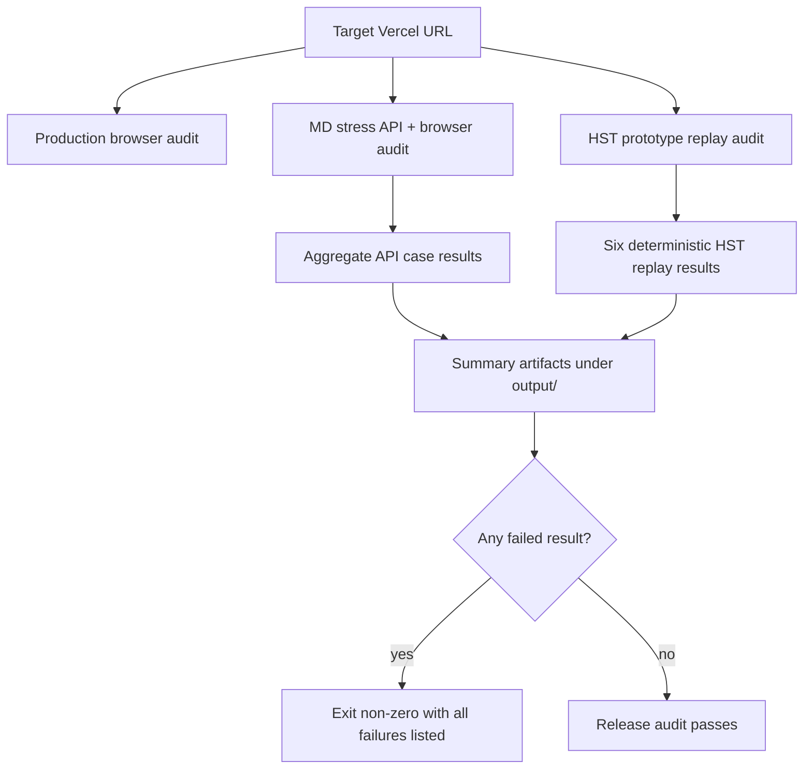

# fix: Close Vercel audit failure gaps

## Overview

This plan makes the Vercel production audit surface reliable after the HST prototype fixes. It updates the stale MD stress expectation that currently treats `100 -> 119 ng/L` as a 4-hour-pending branch, ensures MD stress reports all API failures before exiting, and adds a reusable production replay for the six previously failed HST prototype cases.

---

## Problem Frame

The new Vercel build passed the browser production audit and the six prior HST failure replays, but `audit:prod:md-stress` still exits non-zero on one API case: `20 percent rule below threshold asks 4h`. Production returns terminal `CHRONIC_INJURY` for male HST `100 -> 119 ng/L` with no ischemic repeat EKG. That behavior matches the canonical decision-tree test and pathway audit notes: high-value values use the 20% rule, `119` is below the 20% threshold, and above-URL without significant delta routes to Chronic Injury.

The audit failure is therefore harness drift, not a clinical pathway regression. The current MD stress runner also appears to stop API evaluation at the first failed case, so one bad expectation can mask later API failures. The next implementation should fix both the known expectation and the audit completeness gap.

---

## Requirements Trace

**Audit correctness**

- R1. The MD stress API case for HST `100 -> 119 ng/L` must expect the current canonical pathway result: terminal `CHRONIC_INJURY`, not `requiredField: hst4`.
- R2. The MD stress suite must still keep separate coverage for true below-URL intermediate deltas that require `hst4`, including `6 -> 10 ng/L`.
- R3. The MD stress suite must keep positive coverage for the high-value 20% rule at threshold, including `100 -> 120 ng/L` routing High Risk.

**Failure discovery**

- R4. The MD stress API runner must aggregate all selected API case failures before exiting non-zero, so the summary reports every failing case instead of stopping at the first mismatch.
- R5. Audit summaries must preserve enough expected-versus-actual detail for each API failure to classify whether the app or harness is wrong.

**Vercel regression coverage**

- R6. The six previously failed HST prototype scenarios must be reusable as a production or preview audit, not only as local unit tests or one-off shell snippets.
- R7. The production audit flow must verify both browser/UI health and deterministic `/api/chat` pathway-state results against the target Vercel URL.
- R8. No production audit fix may weaken canonical pathway tests or change clinical behavior unless a new failing app behavior is proven against those canonical expectations.

---

## Scope Boundaries

- Do not change `src/lib/tools.ts` or `src/lib/pathway-controller.ts` for the known `100 -> 119 ng/L` failure unless a new canonical mismatch is discovered during implementation.
- Do not replace the existing browser audit or MD stress audit; extend and correct them.
- Do not depend on LLM free-text output for pass/fail decisions when `data-pathway-state` exposes deterministic controller state.
- Do not make Vercel configuration or deployment workflow changes unless the audit cannot access the target build through existing `PROD_BASE_URL` behavior.
- Do not claim clinical validation. This work improves technical audit fidelity for a CDS prototype.

---

## Context & Research

### Relevant Code and Patterns

- `scripts/audit-prod-md-stress.mjs` owns the failing case and writes `output/md-stress/md-stress-summary.json`.
- `scripts/audit-prod-browser.mjs` already performs production browser smoke checks and API seam checks, writing `output/playwright/prod-browser-audit-summary.json`.
- `scripts/clinician-judge-result.mjs` and `src/lib/clinician-judge-result.test.mjs` provide a pattern for extracting pure result-classification helpers from scripts and testing them without live browser/API work.
- `src/__tests__/pathway-decision-tree-30.test.ts` already establishes `100 -> 119 ng/L` as non-significant under the 20% rule and terminal `CHRONIC_INJURY`.
- `docs/audits/pathway-build-audit.md` documents that above-URL without significant delta routes to Chronic Injury.
- `docs/plans/2026-06-22-001-fix-hst-prototype-failures-plan.md` records the prior HST prototype fix requirements and acceptance examples.

### External References

- External research is not needed. The work is constrained by repo-local Rush pathway tests, audit scripts, and the observed Vercel audit output.

---

## Key Technical Decisions

- **Fix harness drift, not pathway logic:** The known failure contradicts the canonical tests and audit document, so the implementation should update the MD stress expectation rather than altering clinical controller behavior.
- **Aggregate API failures before browser flows finish:** A production audit is most useful when one run tells the implementer every failing API case. The runner should record each API mismatch and continue through the selected API case set before returning a failed status.
- **Add a dedicated HST replay audit:** The six prototype failures are high-value regression scenarios. They deserve a scriptable production replay surface so future Vercel builds can be checked without reconstructing request payloads manually.
- **Keep deterministic state as the audit oracle:** Production pass/fail checks should inspect `data-pathway-state` results and `requiredField` values, not prose generated by the model.

---

## Open Questions

### Resolved During Planning

- **Is `100 -> 119 ng/L` an app failure or an audit failure?** Treat it as audit harness drift. Canonical tests and audit docs expect non-significant high-value above-URL cases to route terminal `CHRONIC_INJURY`.
- **Should this work change clinical pathway logic?** No, not for the known failure. Clinical logic changes are deferred unless implementation discovers a mismatch against canonical pathway tests.

### Deferred to Implementation

- **Exact helper extraction shape:** The implementer may choose whether `scripts/md-stress-result.mjs` exports aggregation helpers or whether equivalent pure helpers live inside the existing script with import-safe guards, as long as the aggregation behavior is testable without live Vercel calls.
- **Preview access mechanics:** Protected Vercel preview access may require a share-cookie setup during execution. The production script should keep the existing `PROD_BASE_URL` target contract and not hardcode one access mechanism.

---

## Acceptance Examples

- AE1. Given the MD stress case with male HST `100 -> 119 ng/L`, when run against the new Vercel build, then the case passes when the terminal risk is `CHRONIC_INJURY`.
- AE2. Given the MD stress case with HST `6 -> 10 ng/L`, when run against the new Vercel build, then the case still expects `requiredField: hst4`.
- AE3. Given the MD stress case with HST `100 -> 120 ng/L`, when run against the new Vercel build, then the case still expects terminal `HIGH`.
- AE4. Given two deliberately failing API expectations in the selected MD stress API case set, when the API runner evaluates the selected set, then the summary records both failures, keeps evaluating later selected cases, and exits non-zero after API evaluation completes.
- AE5. Given the six previous HST prototype failures, when the reusable Vercel replay audit runs against production or preview, then all six expected controller outcomes are checked and written to a summary artifact.

---

## High-Level Technical Design

> This illustrates the intended approach and is directional guidance for review, not implementation specification. The implementing agent should treat it as context, not code to reproduce.

---

## Implementation Units

### U1. Correct the Stale MD Stress Expectation

**Goal:** Align the known failing MD stress case with the canonical Rush pathway behavior.

**Requirements:** R1, R2, R3, R8.

**Dependencies:** None.

**Files:**
- Modify: `scripts/audit-prod-md-stress.mjs`
- Test: `src/lib/prod-browser-audit.test.ts`

**Approach:**
- Rename the `20 percent rule below threshold asks 4h` case so its name reflects the actual canonical branch.
- Change its expected outcome from `requiredField: hst4` to terminal `CHRONIC_INJURY`.
- Keep the existing below-URL intermediate cases as the source of truth for `hst4` pending behavior.
- Keep the at-threshold `100 -> 120 ng/L` High Risk case unchanged.

**Patterns to follow:**
- Follow the nearby `above URL minimal delta routes chronic injury after pain answer` and `20 percent rule at threshold routes high` case shapes.
- Keep expectations in terms of deterministic controller fields.

**Test scenarios:**
- Covers AE1. The updated `100 -> 119 ng/L` case expects terminal `CHRONIC_INJURY`.
- Covers AE2. Existing below-URL intermediate-delta cases still expect `requiredField: hst4`.
- Covers AE3. Existing `100 -> 120 ng/L` case still expects terminal `HIGH`.
- Edge case: test coverage or script contract checks catch accidental removal of the high-value below-threshold case.

**Verification:**
- The MD stress script source contains one case for high-value below-threshold Chronic Injury, one or more below-URL intermediate `hst4` cases, and the high-value at-threshold High Risk case.

### U2. Aggregate All MD Stress API Failures

**Goal:** Ensure production MD stress reports every selected API failure in one run.

**Requirements:** R4, R5, R7.

**Dependencies:** None.

**Files:**
- Modify: `scripts/audit-prod-md-stress.mjs`
- Create or modify: `scripts/md-stress-result.mjs`
- Test: `src/lib/md-stress-result.test.mjs`
- Test: `src/lib/prod-browser-audit.test.ts`

**Approach:**
- Extract pure result-summary and failure-aggregation behavior from the MD stress script, following the helper-module pattern used by the clinician judge harness.
- Change the API loop so each selected case records pass/fail detail and appends an API summary, rather than throwing out of the whole API phase on the first mismatch.
- Preserve the final non-zero exit when any API or browser stress check fails.
- Include expected and actual fields in failure detail, including `requiredField`, `terminal`, `risk`, `action`, accepted fields, and relevant values.
- Preserve browser stress execution after API failures when Playwright can launch, so a single API mismatch does not hide browser regressions.

**Patterns to follow:**
- Mirror `scripts/clinician-judge-result.mjs` plus `src/lib/clinician-judge-result.test.mjs` for pure helper testing.
- Preserve the existing `results` array and JSON summary shape so current consumers do not break.

**Test scenarios:**
- Covers AE4. Two failing API cases produce two recorded failures and one non-zero aggregate status.
- Happy path: all passing API cases produce no failures and keep the expected API summary count.
- Edge case: a thrown request/parse error for one API case is recorded as that case's failure and does not skip later selected cases.
- Edge case: a failure in an early selected API case does not prevent later selected API cases from adding API summaries.
- Error path: browser stress failures still produce a non-zero final status after API aggregation completes.
- Integration: `apiCasesRun` equals the selected API case count even when one or more cases fail.

**Verification:**
- A failing API expectation no longer prevents later selected API cases from being evaluated and written to the summary.

### U3. Add a Reusable HST Prototype Vercel Replay Audit

**Goal:** Turn the six previously failed HST prototype replay cases into a maintained production or preview audit.

**Requirements:** R6, R7, R8.

**Dependencies:** U1.

**Files:**
- Create: `scripts/audit-prod-hst-regressions.mjs`
- Modify: `package.json`
- Test: `src/lib/prod-browser-audit.test.ts`
- Reference: `src/__tests__/hst-prototype-regression.test.ts`

**Approach:**
- Implement a small production API audit that posts the six existing HST regression conversations to `/api/chat` on the configured target URL.
- Reuse the same expected outcomes from `src/__tests__/hst-prototype-regression.test.ts`: significant below-URL delta High Risk, high-value 20% delta High Risk, falling significant delta High Risk, intermediate 4-hour branch Intermediate, female above-URL minimal delta Chronic Injury, and compound duration advancing to `hst0`.
- Write a compact JSON summary under `output/hst-regressions/`.
- Keep the script targetable through the same `PROD_BASE_URL` convention as the other production audits.

**Patterns to follow:**
- Follow `scripts/audit-prod-browser.mjs` and `scripts/audit-prod-md-stress.mjs` for target URL handling and output directory conventions.
- Follow `src/__tests__/hst-prototype-regression.test.ts` for expected clinical outcomes.

**Test scenarios:**
- Covers AE5. All six HST replay cases pass against a conforming controller stream.
- Happy path: the script identifies `data-pathway-state` and extracts nested `determine_disposition` and `calculate_delta` results.
- Edge case: a non-terminal expected case, compound duration, passes only when `requiredField` is `hst0` and `symptomDurationHours` is `3.25`.
- Error path: a response with no `data-pathway-state` records a failure with enough response context to debug the target URL.
- Integration: the package script is exposed and documented alongside the existing production audit scripts.

**Verification:**
- The reusable HST replay audit reports six selected cases, writes a summary artifact, and exits non-zero if any expected controller outcome fails.

### U4. Update Audit Documentation and Release Checklist

**Goal:** Make the production audit procedure explicit so future Vercel builds can be checked consistently.

**Requirements:** R5, R6, R7.

**Dependencies:** U1, U2, U3.

**Files:**
- Modify: `README.md`
- Modify: `PRE_DEPLOYMENT_CHECKLIST.md`
- Modify: `docs/audits/pathway-build-audit.md`
- Modify: `docs/validation/PRODUCTION_READINESS_CHECKLIST.md`

**Approach:**
- Document the three production audit layers: browser audit, MD stress audit, and HST prototype replay audit.
- Clarify that MD stress API cases are deterministic controller-faithfulness checks, not independent clinical validation.
- Record that high-value below-threshold non-significant above-URL cases are expected to route Chronic Injury, while below-URL intermediate deltas remain 4-hour pending.
- Update release checklist language so a Vercel build is not considered audit-clean unless all production audit scripts pass or any remaining failure is explicitly classified and tracked.

**Patterns to follow:**
- Keep the current safety posture language from `docs/validation/PRODUCTION_READINESS_CHECKLIST.md`.
- Keep audit evidence concise, as in `docs/audits/pathway-build-audit.md`.

**Test scenarios:**
- Test expectation: none -- documentation-only changes after behavioral and harness coverage are handled by U1-U3.

**Verification:**
- A reviewer can identify exactly which production audit surfaces to run for a new Vercel build and how to interpret the known high-value below-threshold branch.

---

## System-Wide Impact

- **Clinical pathway behavior:** Expected to remain unchanged for the known failure. Any clinical logic change discovered during implementation must be backed by canonical pathway tests before merging.
- **Audit reliability:** MD stress becomes a full failure enumerator rather than a first-failure stopper.
- **Release workflow:** Future Vercel build checks gain a maintained HST replay audit in addition to broad browser and adversarial stress coverage.
- **Artifact lifecycle:** Existing ignored `output/` artifacts remain the place for audit summaries and screenshots.

---

## Risks & Dependencies

| Risk | Mitigation |
|------|------------|
| A stale audit expectation could be "fixed" by changing correct app behavior. | Anchor U1 to canonical tests and audit docs before changing any controller logic. |
| Aggregating failures could hide non-zero exit behavior. | Unit-test aggregate status separately from per-case recording. |
| A new HST replay script could drift from local regression tests. | Source expected cases from the same clinical scenarios and document both file references. |
| Vercel protected previews may require authenticated/share-cookie access. | Keep `PROD_BASE_URL` target support and treat preview access setup as an execution-time environment concern, not a hardcoded script dependency. |

---

## Documentation / Operational Notes

- The production release checklist should treat the browser audit, MD stress audit, and HST replay audit as separate signals.
- Summary artifacts should be kept under ignored `output/` directories and not committed.
- If a future production audit failure contradicts canonical deterministic tests, classify it first as harness drift versus app regression before changing clinical logic.

---

## Sources & References

- Existing HST fix plan: `docs/plans/2026-06-22-001-fix-hst-prototype-failures-plan.md`
- MD stress audit script: `scripts/audit-prod-md-stress.mjs`
- Browser audit script: `scripts/audit-prod-browser.mjs`
- Clinician judge helper pattern: `scripts/clinician-judge-result.mjs`
- Clinician judge helper tests: `src/lib/clinician-judge-result.test.mjs`
- Production audit script contract tests: `src/lib/prod-browser-audit.test.ts`
- Canonical pathway audit: `src/__tests__/pathway-decision-tree-30.test.ts`
- HST prototype regression tests: `src/__tests__/hst-prototype-regression.test.ts`
- Pathway build audit: `docs/audits/pathway-build-audit.md`
