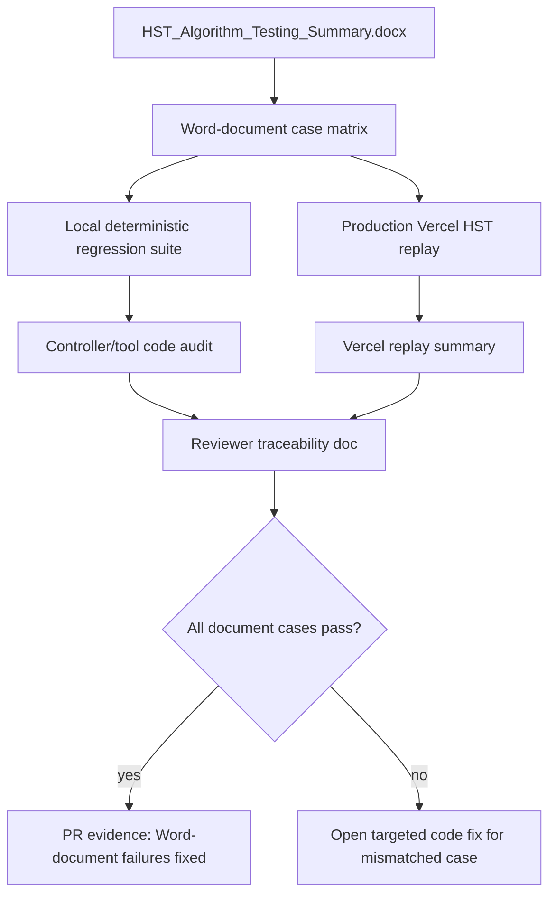

# test: Audit HST Word document cases end to end

## Summary

This plan turns the June 2026 HST Algorithm Testing Summary Word document into an explicit source-of-truth audit surface. The current branch already contains fixes and tests for the six named bugs; the remaining work is to prove every Word-document case, including the originally passing cases, is represented in local tests, production Vercel replay, and reviewer-facing traceability.

---

## Problem Frame

The Word document reports 12 tested clinical scenarios: 6 passed, 4 failed, and 2 partially passed. The named failures are all pathway-safety or workflow defects around serial troponin branching, 20% delta handling, chronic injury eligibility, sex-specific URL use, redundant prompts, and compound symptom-duration parsing.

The repo now has a six-case prototype regression suite and a six-case production HST replay. That is sufficient for the previously failed or partial cases, but it does not yet give Eric or a reviewer a single artifact showing that all 12 cases from the Word document have been checked against the updated code and live Vercel build.

---

## Requirements

### Source Document Traceability

- R1. Every case in `HST_Algorithm_Testing_Summary.docx` must appear in a repo audit matrix with the source case ID, scenario name, original result, bug reference when present, expected updated behavior, local test coverage, and Vercel replay coverage.
- R2. The audit matrix must include both `Case 1` and `Case 1b` as separate STEMI and STEMI-equivalent cases because the document counts them separately in the 12-case total.
- R3. The general symptom-duration parsing bug must be traced even though it is listed under the bug report rather than as a numbered case row.

### Code Correctness

- R4. The code must preserve deterministic, server-owned clinical logic for all threshold, delta, HEART, and disposition decisions.
- R5. The six named bugs must remain fixed by direct assertions against controller/tool behavior, not by relying on generated assistant prose.
- R6. Existing broad pathway behavior for the six originally passing cases must remain protected by exact or mapped regression coverage.

### Production Verification

- R7. The production HST replay audit must be able to exercise all 12 Word-document cases against a target Vercel URL.
- R8. Production pass/fail checks must inspect deterministic `data-pathway-state` fields such as `requiredField`, `terminal`, `risk`, `action`, delta category, and parsed values.
- R9. Documentation must make clear which checks prove the Word-document failures are fixed and which checks are broader technical regression coverage.

---

## Word Document Case Trace

| Source case | Scenario | Original result | Updated expected behavior |
|---|---|---:|---|
| Case 1 | STEMI, classic presentation | PASS | Immediate terminal STEMI pathway; no hs-TnI pathway continuation. |
| Case 1b | STEMI equivalent, de Winter pattern | PASS | STEMI-equivalent classification should terminate to STEMI pathway. |
| Case 2 | Low-risk chest pain, early rule-out | PASS | HST <5 ng/L, symptoms >3 hr, low suspicion, and no ESRD should route Low Risk. |
| Case 3 | Rising troponin, significant 2-hour delta | FAIL | Absolute delta >=15 ng/L should route High Risk without 4-hour HST. |
| Case 4 | Falling troponin, recent MI | PARTIAL | Falling delta >=15 ng/L should route High Risk without asking ongoing chest pain. |
| Case 5 | 0-hour troponin >100, 20% delta rule | FAIL | High-value relative delta >=20% should route High Risk at 2 hours. |
| Case 6 | 4-hour draw required, 2-hour delta 4-14 | FAIL | Below-URL intermediate 2-hour delta should request 4-hour HST; after 4-hour follow-up, Chronic Injury must not appear solely because the pathway reached that branch. |
| Case 7 | Significant 4-hour delta, admit | PASS | Significant 4-hour delta should route High Risk / Admit. |
| Case 8 | Stable chronic troponin elevation, CKD | PASS | Above-URL, non-significant serial troponins on the MI-ruled-out branch should route Chronic Injury evaluation. |
| Case 9 | ESRD mandatory 2-hour draw override | PASS | ESRD should block 0-hour early rule-out and require serial HST. |
| Case 10 | Symptoms <4 hr, early presenter | PASS | Early presenters should require repeat/serial HST instead of finalizing too early. |
| Case 11 | Female-specific URL at 16 ng/L | FAIL | Female URL threshold must be 14 ng/L; above-URL non-significant serial values should route Chronic Injury evaluation rather than 4-hour HST. |
| General bug | Free-text `3 hours 15 minutes` | LOW | Compound duration text should parse to 3.25 hours and advance the pathway. |

---

## Key Technical Decisions

- **Make the Word document the explicit audit source:** Current tests cover the clinical bug cluster, but reviewers need a one-to-one case matrix so the document can be audited without reading scattered test files.
- **Keep clinical assertions on deterministic state:** All local and production checks should use controller snapshots and tool outputs, not free-text assistant responses.
- **Expand production replay from failure replay to document replay:** The current six-case Vercel audit is valuable, but the Word document asks for confidence across all 12 tested scenarios.
- **Treat current code as mostly repaired, then verify:** The plan should not prescribe new clinical behavior unless the expanded audit finds a mismatch. The known fixes live in controller branch ordering, delta calculation, disposition eligibility, sex-specific URL evaluation, and duration parsing.
- **Separate branch semantics for Chronic Injury and 4-hour follow-up:** Chronic Injury is correct for above-URL, non-significant MI-ruled-out serial values; it is not a generic fallback after the intermediate-delta 4-hour branch.

---

## High-Level Technical Design

---

## Implementation Units

### U1. Add a Word-Document Traceability Audit

**Goal:** Create a durable audit artifact that maps every Word-document case and bug to the updated code and verification surface.

**Requirements:** R1, R2, R3, R9.

**Files:**
- Create: `docs/audits/hst-word-document-traceability.md`
- Reference: `docs/audits/pathway-build-audit.md`
- Reference: `docs/plans/2026-06-22-001-fix-hst-prototype-failures-plan.md`
- Reference: `docs/plans/2026-06-22-002-fix-vercel-audit-failures-plan.md`

**Approach:** Use the Word document case table as the source list. For each case, record the expected updated behavior, the local test location that proves it, the production audit case that replays it, and any remaining gap. Do not mark a case covered by broad pathway testing unless the mapping is specific enough for a reviewer to understand.

**Test scenarios:**
- Case matrix contains 12 clinical cases plus the general compound-duration bug.
- Each failed or partial case links to an exact regression assertion.
- Each originally passing case links either to an exact Word-document replay case or a clearly named canonical test that covers the same branch.
- The traceability artifact distinguishes Chronic Injury branch eligibility from 4-hour follow-up behavior.
- The traceability artifact does not claim clinical validation beyond technical pathway conformance.

**Verification:** A reviewer can start from the Word document and find corresponding local and production coverage for every row without interpreting source code.

### U2. Expand Local Regression Coverage to All Word-Document Cases

**Goal:** Ensure local deterministic tests represent the full Word-document testing plan, not only the six bug cases.

**Requirements:** R2, R3, R4, R5, R6.

**Files:**
- Modify: `src/__tests__/hst-prototype-regression.test.ts`
- Reference: `src/__tests__/pathway-decision-tree-30.test.ts`
- Reference: `src/lib/pathway-controller.test.ts`
- Reference: `src/lib/chat-request.test.ts`
- Reference: `src/lib/pathway-state.test.ts`

**Approach:** Keep the existing six bug regressions, then add exact or near-exact tests for the six originally passing Word-document scenarios. If an existing canonical test already covers a case, add a named wrapper or comment-level mapping in the prototype regression file so the Word-document case remains discoverable by name.

**Test scenarios:**
- Case 1: classic STEMI returns terminal `STEMI_PATHWAY` with no required field.
- Case 1b: de Winter or STEMI-equivalent wording returns terminal `STEMI_PATHWAY`.
- Case 2: low-risk early rule-out returns `LOW` only after low clinical suspicion is explicit.
- Case 3: rising 2-hour delta >=15 ng/L returns `HIGH` and does not request `hst4`.
- Case 4: falling delta >=15 ng/L returns `HIGH` and does not request `ongoingChestPain`.
- Case 5: high-value 20% delta returns `HIGH` at 2 hours.
- Case 6: below-URL 2-hour delta 4-14 requests `hst4`, and non-high-risk 4-hour follow-up does not return `CHRONIC_INJURY`.
- Case 7: significant 4-hour delta returns `HIGH`.
- Case 8: stable above-URL, non-significant serial troponin returns `CHRONIC_INJURY`.
- Case 9: ESRD plus low 0-hour HST still requires 2-hour HST.
- Case 10: symptoms under 4 hours require serial/repeat HST rather than early final disposition.
- Case 11: female 0-hour HST 16 ng/L uses the 14 ng/L URL threshold and routes according to above-URL, non-significant serial logic.
- General bug: `3 hours 15 minutes` parses to 3.25 hours and advances to the 0-hour HST step.

**Verification:** The local regression suite makes every Word-document case searchable by source case number or scenario name.

### U3. Code-Review the Six Named Bug Fixes Against Current Implementation

**Goal:** Confirm the updated code is correct for each Word-document bug and has not only been made to pass a narrow test.

**Requirements:** R4, R5.

**Files:**
- Review: `src/lib/pathway-controller.ts`
- Review: `src/lib/tools.ts`
- Review: `src/lib/chat-request.ts`
- Review: `src/lib/pathway-state.ts`
- Test: `src/__tests__/hst-prototype-regression.test.ts`
- Test: `src/__tests__/pathway-decision-tree-30.test.ts`

**Approach:** Audit each named bug against the implementation owner. The controller should own branch ordering and prompt suppression. The tools should own sex-specific URL, delta category, 20% high-value logic, and disposition semantics. The sanitizer/state parser should own compound duration handling. Any mismatch should become a focused code fix plus a local regression assertion.

**Test scenarios:**
- BUG-01: `calculate_delta` reports significant for absolute delta >=15 ng/L, and the controller terminates High Risk before any 4-hour prompt.
- BUG-02: `calculate_delta` uses the 20% method when either compared HST value is >=100 ng/L, and the controller consumes significant high-value deltas as terminal High Risk.
- BUG-03: `determine_disposition` can return Chronic Injury for above-URL non-significant serial values before a 4-hour branch, but not as an automatic post-4-hour fallback.
- BUG-04: `evaluate_troponin` uses 14 ng/L as the female 99% URL and the controller does not request 4-hour HST for female above-URL non-significant serial values.
- BUG-05: the controller does not ask ongoing chest pain after a significant falling delta already determines High Risk.
- BUG-06: active-question sanitization and direct state extraction both normalize compound duration text.

**Verification:** Each bug has one implementation owner, one direct assertion, and one end-to-end controller assertion.

### U4. Expand Vercel HST Replay to All 12 Word-Document Cases

**Goal:** Make the live Vercel audit replay the full Word-document plan.

**Requirements:** R1, R2, R3, R7, R8, R9.

**Files:**
- Modify: `scripts/audit-prod-hst-regressions.mjs`
- Modify: `src/lib/prod-browser-audit.test.ts`
- Modify: `package.json` only if the script name changes
- Reference: `scripts/audit-prod-browser.mjs`
- Reference: `scripts/audit-prod-md-stress.mjs`

**Approach:** Rename the audit internally from a six-failure replay to a Word-document replay, or add a second all-case case set while keeping the current package command stable. Each case should post the clinician-message sequence to `/api/chat`, extract `data-pathway-state`, summarize deterministic fields, and compare expected values. Keep the output under ignored audit artifacts.

**Test scenarios:**
- Production replay reports 12 clinical cases plus the compound-duration parsing bug, or records the compound-duration bug as a named parser replay within the 12-case audit summary.
- STEMI and de Winter cases pass only when terminal action is `STEMI_PATHWAY`.
- Early rule-out passes only when terminal risk is `LOW`.
- Significant 2-hour, falling 2-hour, high-value 20%, and significant 4-hour cases pass only when terminal risk is `HIGH`.
- Intermediate 2-hour below-URL case passes only when it requests `hst4` before 4-hour data and avoids Chronic Injury after non-high-risk 4-hour follow-up.
- Chronic injury and female URL cases pass only when risk is `CHRONIC_INJURY` with the expected serial-branch context.
- ESRD and early-presenter cases pass only when they require the serial/repeat HST path.
- Compound duration passes only when `symptomDurationHours` is 3.25 and the next required field is `hst0`.

**Verification:** The production audit summary contains per-case expected and actual deterministic fields, and the command exits non-zero if any Word-document case fails.

### U5. Update Documentation and PR Evidence

**Goal:** Make the fix easy to review by a non-technical clinical stakeholder and by a code reviewer.

**Requirements:** R1, R7, R8, R9.

**Files:**
- Modify: `README.md`
- Modify: `PRE_DEPLOYMENT_CHECKLIST.md`
- Modify: `docs/audits/pathway-build-audit.md`
- Modify: `docs/validation/PRODUCTION_READINESS_CHECKLIST.md`
- Reference: `docs/audits/hst-word-document-traceability.md`

**Approach:** Replace six-case-only wording where appropriate with Word-document coverage language after the all-case audit exists. Keep the clinical wording plain: say which bad behaviors were removed, which pathway branches now happen correctly, and which automated checks prove it.

**Test scenarios:**
- Documentation names the full Word-document replay audit rather than implying only the six failed cases were checked.
- Readiness checklists require the local all-case regression and production all-case replay.
- `docs/audits/pathway-build-audit.md` records the all-case pass result and distinguishes local tests from live Vercel replay.
- Non-technical summary language avoids implementation jargon while preserving the six bug fixes.

**Verification:** A reviewer can see the Word-document audit command, expected evidence files, and pass criteria from the README/checklists without reading implementation code.

---

## Scope Boundaries

- Do not change clinical pathway behavior unless the all-case audit exposes a mismatch against the Word document or canonical Rush pathway rules.
- Do not use generated assistant prose as the pass/fail oracle for clinical behavior.
- Do not remove the existing 30-case decision-tree audit, MD stress audit, or browser audit; this work adds source-document traceability on top.
- Do not claim external clinical validation. This is a technical conformance audit for the prototype against the tester-provided Word document.

---

## Risks & Dependencies

| Risk | Mitigation |
|---|---|
| The Word document has scenario names but not full raw input transcripts for every case. | Use clinically equivalent deterministic inputs and document expected branch behavior in the traceability matrix. |
| The production replay could drift from local regressions. | Keep case names and expected deterministic fields aligned between `src/__tests__/hst-prototype-regression.test.ts` and `scripts/audit-prod-hst-regressions.mjs`. |
| A broad audit could mask which bug regressed. | Report per-case expected and actual fields in the summary artifact. |
| Chronic Injury wording can be misunderstood as a generic safe endpoint. | Document it as branch-specific: above-URL, non-significant MI-ruled-out serial values only, not an automatic post-4-hour fallback. |
| Vercel preview protection could block live replay. | Keep `PROD_BASE_URL` target support and use production or an accessible preview URL for the audit. |

---

## Documentation / Operational Notes

The all-case audit should preserve the current production safety posture: local deterministic tests prove code behavior, and Vercel replay proves the deployed build exposes the same deterministic controller state. The final reviewer note to Eric should stay plain-language and focus on the observed bad behaviors that were fixed rather than on file names or implementation internals.
